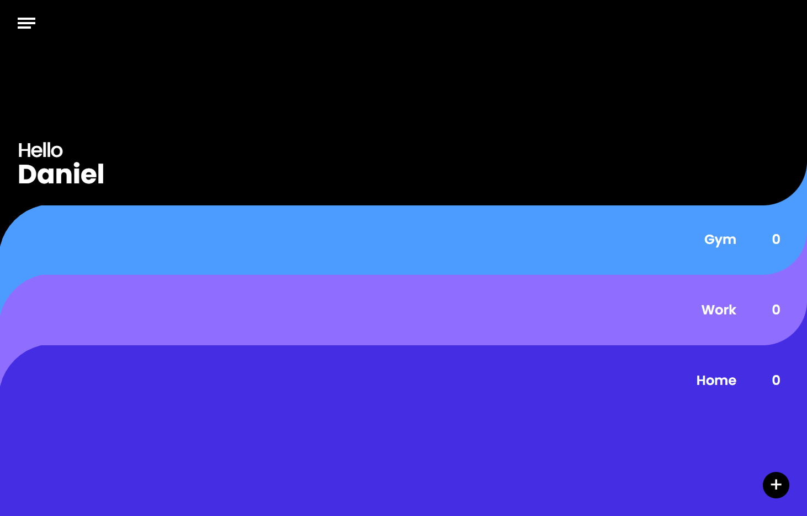

# Frontend Todolist

This is a frontend solution to a todolist design.

## Table of contents

- [Overview](#overview)
  - [The challenge](#the-challenge)
  - [Screenshot](#screenshot)
  - [Links](#links)
- [My process](#my-process)
  - [Built with](#built-with)
  - [What I learned](#what-i-learned)
  - [Continued development](#continued-development)
  - [Useful resources](#useful-resources)
- [Author](#author)
- [Acknowledgments](#acknowledgments)

## Overview

### The challenge

Users should be able to:

- View the optimal layout for the site depending on their device's screen size
- Create different task lists and add tasks to each list

### Screenshot

### Links

- Solution URL: [https://github.com/wavegate/TodoList](https://github.com/wavegate/TodoList)
- Live Site URL: [https://dainty-donut-651188.netlify.app/](https://dainty-donut-651188.netlify.app/)

## My process

- This was the first part of a series where I build out designs I find and try to implement best practices. This is for practice purposes. At this point, I was preparing for my first frontend developer position and was watching a lot of React YouTubers such as Jack Herrington and Web Dev Junkie.

### Built with

- TailwindCSS
- React
- Redux
- React hook form

**Note: These are just examples. Delete this note and replace the list above with your own choices**

### What I learned

- **Note: Delete this note and the content within this section and replace with your own learnings.**

### Continued development

- This project is a continuing playground for me to implement and refactor my code for best practices. The following are things I want to add in order to prepare myself as a fullstack web engineer. I will add more to it as I learn more about what I do not yet know.
- Semantic HTML5 markup
- Mobile-first workflow
- SEO
- Build out backend with tRPC and/or React query
- Testing
- CI/CD eg. with GitHub actions
- AWS
- Next.js
- Prisma
- Dark mode
- Cross-browser compatibility

### Useful resources

- [Example resource 1](https://www.example.com) - This helped me for XYZ reason. I really liked this pattern and will use it going forward.
- [Example resource 2](https://www.example.com) - This is an amazing article which helped me finally understand XYZ. I'd recommend it to anyone still learning this concept.

**Note: Delete this note and replace the list above with resources that helped you during the challenge. These could come in handy for anyone viewing your solution or for yourself when you look back on this project in the future.**

## Author

- Website - [wavegate](https://github.com/wavegate)
- Frontend Mentor - [@wavegate](https://www.frontendmentor.io/profile/wavegate)

**Note: Delete this note and add/remove/edit lines above based on what links you'd like to share.**

## Acknowledgments

This is where you can give a hat tip to anyone who helped you out on this project. Perhaps you worked in a team or got some inspiration from someone else's solution. This is the perfect place to give them some credit.

**Note: Delete this note and edit this section's content as necessary. If you completed this challenge by yourself, feel free to delete this section entirely.**
